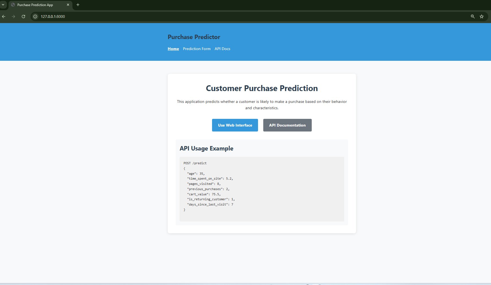
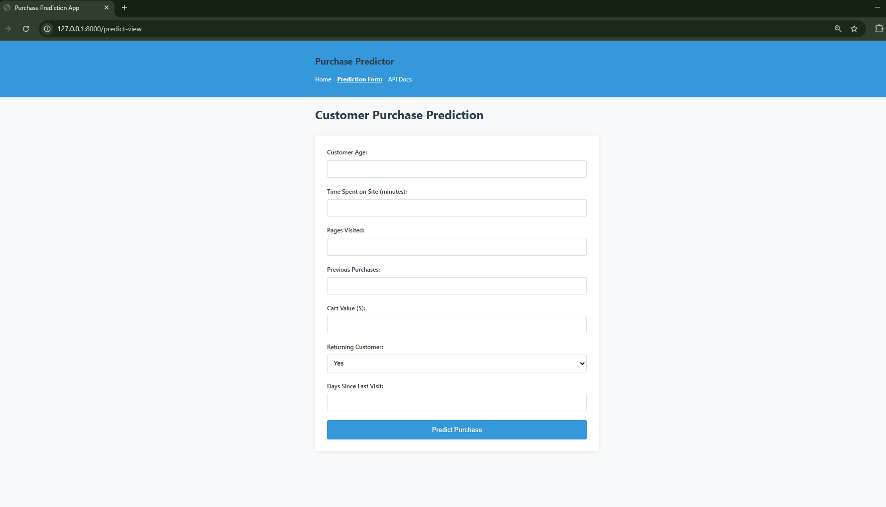
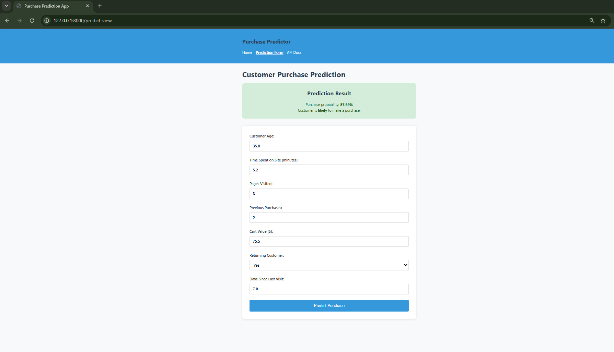
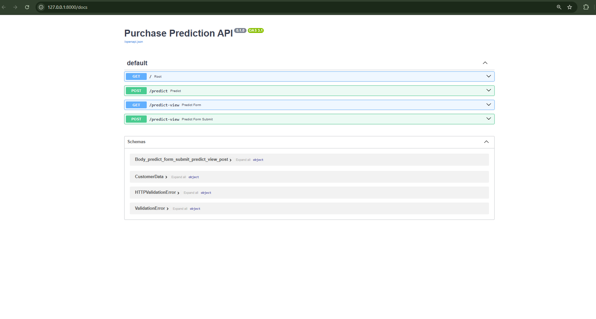

# Customer Purchase Prediction App

## 1. Overview

The Customer Purchase Prediction App is a machine learning-powered web application that predicts whether a customer is likely to make a purchase based on their characteristics and behaviors. Built with FastAPI, this application provides both a user-friendly web interface and a REST API for integration with other systems.

### Key Features:

- **Machine Learning Model**: Utilizes a logistic regression model to predict purchase likelihood
- **Dual Interfaces**: Provides both a web form for human interaction and a REST API for programmatic access
- **Real-time Predictions**: Instantly calculates purchase probability based on customer attributes
- **Responsive Design**: Works on desktop and mobile devices

The application is designed for marketing teams, e-commerce businesses, and customer experience managers who want to:
- Target marketing campaigns more effectively
- Personalize customer experiences based on purchase likelihood
- Optimize sales strategies with data-driven insights
- Improve inventory management and sales forecasting

## 2. Clone from GitHub

To get started with the project, clone it from GitHub using the following commands:

```bash
# Clone the repository
git clone https://github.com/yourusername/purchase-prediction-app.git

# Navigate into the project directory
cd purchase-prediction-app
```

## 3. Create Venv and Run Locally
Prerequisites:
- Python 3.12+ installed
- pip (Python package installer)

### Setup and Installation:
```bash
# Create a virtual environment
python -m venv venv

# Activate the virtual environment
# On Windows:
venv\Scripts\activate
# On macOS/Linux:
source venv/bin/activate

# Install dependencies
pip install -r requirements.txt

# Run the application
uvicorn app.main:app --reload
```

### The application will be available at:
- Web interface: http://localhost:8000/ and http://localhost:8000/predict-view
- API documentation: http://localhost:8000/docs
- API endpoint: http://localhost:8000/predict (POST)

### Testing the API:
You can test the API using curl or any API client:
```bash
curl -X 'POST' \
  'http://localhost:8000/predict' \
  -H 'Content-Type: application/json' \
  -d '{
  "age": 35,
  "time_spent_on_site": 5.2,
  "pages_visited": 8,
  "previous_purchases": 2,
  "cart_value": 75.5,
  "is_returning_customer": 1,
  "days_since_last_visit": 7
}'
```
## 4. Screenshots

### Home Page

*The landing page provides an overview of the application and quick links to the prediction form and API documentation.*

### Prediction Form

*The web interface allows users to input customer data and get instant purchase predictions.*

### Prediction Results

*After submission, the form displays the prediction results with color-coding based on purchase likelihood.*

### API Documentation

*FastAPI automatically generates interactive API documentation using Swagger UI.*

## 5. Additional Information

### Model Information
The logistic regression model was trained on customer behavior data with the following features:
- Customer age
- Time spent on website
- Number of pages visited
- Previous purchase history
- Cart value
- Customer status (new vs. returning)
- Recency of last visit

### API Response Format

```json
{
  "purchase_probability": 0.78,
  "likely_to_purchase": true
}
```

## Project Structure
```
Customer_Purchase_Prediction/
├── app/
│   ├── main.py              # FastAPI application entrypoint
│   ├── models/              # Pydantic models for data validation
│   │   ├── __init__.py
│   │   └── prediction.py    # Data models for API
│   ├── services/            # Model loading and prediction logic
│   │   ├── __init__.py
│   │   └── predictor.py     # Predictor service
│   ├── static/              # CSS and JavaScript files
│   │   ├── css/
│   │   │   └── styles.css   # Styling for the web interface
│   │   └── js/
│   │       └── script.js    # Client-side functionality
│   └── templates/           # HTML templates
│       ├── base.html        # Base template
│       └── prediction_form.html  # Form template
├── downloaded_model/        # Pre-trained ML model
│   └── purchase_prediction_model.pkl  # The model file
├── requirements.txt         # Project dependencies
└── README.md               # Project documentation
```

